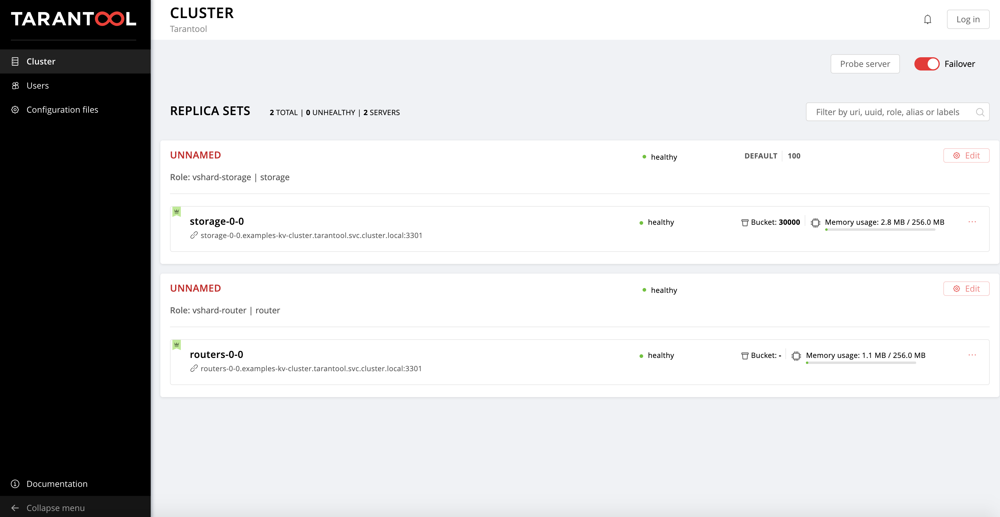

<a href="http://tarantool.org">
   
</a>

# Tarantool Kubernetes operator

[![Test][gh-actions-badge]][gh-actions-url]

The Tarantool Operator provides automation that simplifies the administration
of [Tarantool Cartridge](https://github.com/tarantool/cartridge)-based cluster on Kubernetes.

The Operator introduces new API version `tarantool.io/v1alpha1` and installs
custom resources for objects of three custom types: Cluster, Role, and
ReplicasetTemplate.

## Table of contents

* [Resources](#resources)
* [Resource ownership](#resource-ownership)
* [Deploying the Tarantool operator on minikube](#deploying-the-tarantool-operator-on-minikube)
* [Example: key-value storage](#example-key-value-storage)
  * [Application topology](#application-topology)
  * [Running the application](#running-the-application)
  * [Scaling the application](#scaling-the-application)
  * [Running tests](#running-tests)

## Resources

**Cluster** represents a single Tarantool Cartridge cluster.

**Role** represents a Tarantool Cartridge user role.

**ReplicasetTemplate** is a template for StatefulSets created as members of Role.

## Resource ownership

Resources managed by the Operator being deployed have the following resource
ownership hierarchy:


Resource ownership directly affects how Kubernetes garbage collector works.
If you execute a delete command on a parent resource, then all its dependants
will be removed.

## Deploying the Tarantool operator on minikube

1. Install the required deployment utilities:

    * [kubectl](https://kubernetes.io/docs/tasks/tools/install-kubectl)
    * [helm](https://helm.sh/docs/intro/install/)

    Pick one of these to run a local kubernetes cluster
    * [minikube](https://kubernetes.io/docs/tasks/tools/install-minikube/)
    * [Windows Docker Desktop](https://docs.docker.com/docker-for-windows/#kubernetes)
    * [OSX Docker Desktop](https://docs.docker.com/docker-for-mac/#kubernetes)

    To install and configure a local minikube installation:

    1. Create a `minikube` cluster:

        ```shell
        minikube start --memory=4096
        ```

        You will need 4Gb of RAM allocated to the `minikube` cluster to run examples.

        Ensure `minikube` is up and running:

        ```shell
        minikube status
        ```

        In case of success you will see this output:

        ```shell
        host: Running
        kubelet: Running
        apiserver: Running
        ```

    2. Enable minikube Ingress add-on:

        ```shell
        minikube addons enable ingress
        ```

2. Install the operator

    ```shell
    helm install tarantool-operator ci/helm-chart --namespace tarantool --create-namespace
    ```

    Ensure the operator is up:

    ```shell
    watch kubectl get pods -n tarantool
    ```

    Wait for `tarantool-operator-xxxxxx-xx` Pod's status to become `Running`.

## Example Application: key-value storage

`examples/kv` contains a Tarantool-based distributed key-value storage.
Data are accessed via HTTP REST API.

### Application topology


### Running the application

We assume that commands are executed from the repository root and
Tarantool Operator is up and running.

1. Create a cluster:

    ```shell
    helm install examples-kv-cluster examples/kv/helm-chart --namespace tarantool
    ```

    Wait until all the cluster Pods are up (status becomes `Running`):

    ```shell
    watch kubectl -n tarantool get pods
    ```

2. Ensure cluster became operational:

    ```shell
    kubectl -n tarantool describe clusters.tarantool.io examples-kv-cluster
    ```

    wait until Status.State is Ready:

    ```shell
    ...
    Status:
      State:  Ready
    ...
    ```

3. Access the cluster web UI:

    * If using minikube:

        * Get `minikube` vm IP-address:

        ```shell
        minikube ip
        ```

        * Open **http://MINIKUBE_IP** in your browser.
        Replace MINIKUBE_IP with the IP-address reported by the previous command.

        

        > **_NOTE:_** Due to a recent
        > [bug in Ingress](https://github.com/kubernetes/minikube/issues/2840),
        > web UI may be inaccessible. If needed, you can try this
        > [workaround](https://github.com/kubernetes/minikube/issues/2840#issuecomment-492454708).

    * If using kubernetes in docker-desktop

        Run: (MINIKUBE_IP will be localhost:8081 in this case)

        ```shell
        kc port-forward -n tarantool routers-0-0 8081:8081
        ````

4. Access the key-value API:

   1. Store some value:

       ```shell
       curl -XPOST http://MINIKUBE_IP/kv -d '{"key":"key_1", "value": "value_1"}'
       ```

       In case of success you will see this output:

       ```shell
       {"info":"Successfully created"}
       ```

   2. Access stored values:

       ```shell
       curl http://MINIKUBE_IP/kv_dump
       ```

       In case of success you will see this output:

       ```shell
       {"store":[{"key":"key_1","value":"value_1"}]}
       ```

### Scaling the application

1. Increase the number of replica sets in Storages Role:

    in the examples-kv helm chart, edit the `examples/kv/helm-chart/values.yaml` file to be

    ```yaml
    - RoleName: storage
      ReplicaCount: 1
      ReplicaSetCount: 2
    ```

    Then run:

    ```shell
    helm upgrade examples-kv-cluster examples/kv/helm-chart --namespace tarantool
    ```

    This will add another storage role replica set to the existing cluster. View the new cluster topology via the cluster web UI.

2. Increase the number of replicas across all Storages Role replica sets:

    in the examples-kv helm chart, edit the `examples/kv/helm-chart/values.yaml` file to be

    ```yaml
    - RoleName: storage
      ReplicaCount: 2
      ReplicaSetCount: 2
    ```

    Then run:

    ```shell
    helm upgrade examples-kv-cluster examples/kv/helm-chart --namespace tarantool
    ```

    This will add one more replica to each Storages Role replica set. View the new cluster topology via the cluster web UI.

## Development

### Regenerate the Custom Resource Definitions

```shell
make crds
```

### Building tarantool-operator docker image

```shell
make docker
```

### Running tests

```shell
# In the examples/kv directory
make build
make start
./bootstrap.sh
make test
```

[gh-actions-badge]: https://github.com/tarantool/tarantool-operator/workflows/Test/badge.svg
[gh-actions-url]: https://github.com/tarantool/tarantool-operator/actions
